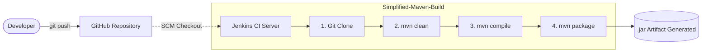

# Continuous Integration: Java & Maven Build Pipeline via Jenkins

**Date:** February 2026  <br>
**Domain:** Continuous Integration (CI) & Build Automation  <br>
**Project:** Automated Java Compilation and Packaging  <br>

## Executive Summary
This project demonstrates the foundational principles of **Continuous Integration (CI)**. <br> By integrating Git version control with a containerized Jenkins CI server, this pipeline automatically pulls Java source code, resolves dependencies, compiles the application, and packages it into an executable artifact (`.jar`) using Apache Maven. 
<br>
This repository serves as a proof-of-concept for automating the software build lifecycle, reducing manual compilation errors, and establishing a reliable deployment pipeline.

## Architecture & CI Flow

The pipeline follows a standard declarative build process, triggered manually or via SCM polling, executing within a temporary workspace on the Jenkins server.



## Tech Stack & Toolchain

| Component | Technology | Description |
| --- | --- | --- |
| **Version Control** | Git & GitHub | Source code management and remote repository. |
| **CI Server** | Jenkins | Containerized automation server orchestrating the build. |
| **Build Tool** | Apache Maven 3.x | Resolves dependencies and executes the build lifecycle. |
| **Language** | Java (JDK 11) | Core application programming language. |
| **Infrastructure** | Docker | Hosts the isolated Jenkins environment. |

## Project Structure

The repository strictly adheres to the standard Maven directory layout:

```text
hello-java-maven/
├── pom.xml                     # Maven project configuration and dependencies
├── README.md                   # Project documentation
├── screenshots/
│   └── jenkins-success.png     # Proof of successful CI build
└── src/
    └── main/
        └── java/
            └── com/
                └── example/
                    └── HelloWorld.java  # Main application source code

```

## Reproduction Steps

### 1. Version Control Setup

```bash
git init
git add .
git commit -m "Initial commit: Java and POM files"
git branch -M main
git remote add origin https://github.com/Indra1806/hello-java-maven.git
git push -u origin main
```

### 2. Jenkins Infrastructure Provisioning

Spin up an isolated Jenkins server using Docker, mapping the standard UI port and allocating a persistent volume for Jenkins data:

```bash
docker run -d -p 8080:8080 -p 50000:50000 -v jenkins_home:/var/jenkins_home --name jenkins-server jenkins/jenkins:lts
```

*(Retrieve the initial admin password from container logs: `docker exec jenkins-server cat /var/jenkins_home/secrets/initialAdminPassword`)*

### 3. Jenkins Tooling Configuration

1. Navigate to **Manage Jenkins** -> **Tools**.
2. Under **Maven installations**, click **Add Maven**.
3. Name: `Maven3`.
4. Check **Install automatically** and save.

### 4. CI Job Configuration

1. Create a new **Freestyle project** named `Syntax-Simplified-Maven-Build`.
2. **Source Code Management:** Select Git, input the repository URL, and specify the `main` branch.
3. **Build Steps:** Add `Invoke top-level Maven targets`.
4. **Maven Version:** Select `Maven3`.
5. **Goals:** `clean package`
6. Save and click **Build Now**.

## Build Results & Artifacts

The pipeline successfully executes the Maven lifecycle.

* **`clean`**: Wipes the previous `/target` directory to prevent artifact contamination.
* **`package`**: Validates the POM, compiles the source code, and bundles the `.class` files into a distributable `.jar` archive.

*(See [Output-Screenshots/Build-console.png](https://github.com/Indra1806/hello-java-maven/blob/main/Output-Screenshots/Build-console.png) for Console Output verifying the `BUILD SUCCESS` exit code).*

## FAQ & Engineering Concepts

**1. What is Jenkins?** <br>
Jenkins is an open-source automation server used to build, test, and deploy software. <br> It facilitates Continuous Integration and Continuous Delivery (CI/CD) by orchestrating pipelines and automating repetitive developmental tasks.

**2. How do you create a Jenkins job?** <br>
Navigate to the Jenkins dashboard -> "New Item" -> Enter a name -> Select the job type (Freestyle, Pipeline, etc.) -> Configure Source Code Management (Git), Build Triggers, and Build Steps -> Save and execute.

**3. What is Maven used for?** <br>
Maven is a build automation and project management tool primarily used for Java projects. It standardizes the directory structure, automatically downloads dependencies from central repositories, and packages the code into executable artifacts.

**4. How does Jenkins use build tools like Maven?** <br>
Jenkins acts as the orchestrator. It pulls the source code from the repository into a temporary workspace, then invokes the build tool (Maven) via command-line execution (e.g., `mvn clean package`). Jenkins monitors the exit code; if Maven returns `0`, the build is marked as successful.

**5. What is the difference between compile and package in Maven?** <br>

* **Compile:** Translates human-readable `.java` source code into machine-readable `.class` bytecodes.
* **Package:** Takes those compiled `.class` files and bundles them into a distributable format like a `.jar` archive. Running the `package` goal automatically triggers the `compile` phase first.

**6. Where do you configure tools in Jenkins?** <br>
Global tools (like JDKs, Maven, Git) are configured under **Manage Jenkins -> Tools**. This allows Jenkins to automatically install and inject these executables into the system PATH of the build jobs without modifying the underlying host OS.

**7. How do you debug a failed Jenkins build?** <br>
The first step is auditing the **Console Output** of the failed run. Engineers look for specific error stack traces (e.g., Compilation Error, Missing Dependency, Syntax Error). <br> Secondary checks include verifying Jenkins has network egress access to GitHub and the Maven Central Repository.
